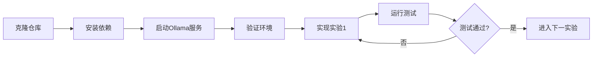

# AI应用课程实验1-4设计文档

## 1. 概览

### 1.1 设计目标

本设计覆盖AI应用课程的基础能力构建阶段（实验1-4），旨在通过渐进式的编程实验，让学生掌握与AI模型进行**可靠、可控、可验证**交互的核心技术。设计遵循"确定性优于随机性"和"测试驱动开发"的核心理念，将传统AI应用的不可预测输出转化为结构化、可编程的数据格式。

### 1.2 核心价值

- **工程化思维培养**：通过强制结构化输出，让学生理解AI应用不是"调参黑盒"，而是可设计、可测试的软件系统
- **即时反馈闭环**：每个实验配套量化测评，学生可在本地快速验证实现正确性
- **技能渐进积累**：从单次调用到有状态交互，从简单分类到链式编排，逐步构建复杂系统能力

### 1.3 技术栈

| 组件 | 技术选型 | 用途说明 |
|------|---------|---------|
| 本地AI模型 | Ollama + Qwen3-8B | 提供标准HTTP API的本地大语言模型服务 |
| 核心框架 | LangChain | AI应用开发框架，提供链式调用、内存管理等能力 |
| 数据验证 | Pydantic | 强制结构化输出，确保类型安全与数据完整性 |
| 测试框架 | Pytest | 编写与运行自动化测评脚本 |
| Python版本 | 3.10+ | 支持现代类型注解与异步特性 |

### 1.4 学习路径

``mermaid
graph LR
    A[实验1: 结构化输出] --> B[实验2: 有状态对话]
    B --> C[实验3: 内存系统]
    C --> D[实验4: LangChain链]
    
    A -.-> E[单点能力:<br/>控制输出格式]
    B -.-> F[状态管理:<br/>会话隔离]
    C -.-> G[数据检索:<br/>历史记录]
    D -.-> H[系统编排:<br/>链式调用]
```

## 2. 项目架构

### 2.1 目录结构

```
/ai-course-labs
├── /grader                    # 测评系统目录
│   ├── __init__.py
│   ├── test_lab1.py          # 实验1测评脚本
│   ├── test_lab2.py          # 实验2测评脚本
│   ├── test_lab3.py          # 实验3测评脚本
│   ├── test_lab4.py          # 实验4测评脚本
│   └── fixtures.py           # 共享测试夹具（Ollama配置等）
│
├── /student_code              # 学生代码目录
│   ├── __init__.py
│   ├── /lab1
│   │   ├── __init__.py
│   │   └── main.py           # 学生实现文件
│   ├── /lab2
│   │   ├── __init__.py
│   │   └── main.py
│   ├── /lab3
│   │   ├── __init__.py
│   │   └── main.py
│   └── /lab4
│       ├── __init__.py
│       └── main.py
│
├── requirements.txt           # Python依赖清单
├── docker-compose.yml         # 本地开发环境（可选）
├── pytest.ini                 # Pytest配置
└── README.md                  # 学生使用指南
```

### 2.2 系统交互流程

``mermaid
sequenceDiagram
    participant 学生
    participant 学生代码
    participant Ollama服务
    participant 测评系统
    
    学生->>学生代码: 实现实验函数
    学生->>测评系统: 运行 pytest grader/test_labX.py
    
    loop 每个测试用例
        测评系统->>学生代码: 调用函数，传入测试输入
        学生代码->>Ollama服务: 发送结构化Prompt
        Ollama服务-->>学生代码: 返回模型输出
        学生代码->>学生代码: 解析为Pydantic模型/字典
        学生代码-->>测评系统: 返回结果
        测评系统->>测评系统: 断言验证
    end
    
    测评系统-->>学生: 输出测试报告
```

### 2.3 依赖配置

**requirements.txt 内容规划**：

```
langchain>=0.1.0
langchain-community>=0.0.10
pydantic>=2.0.0
pytest>=7.4.0
pytest-timeout>=2.1.0
httpx>=0.25.0
```

**pytest.ini 配置说明**：

```ini
[pytest]
testpaths = grader
python_files = test_*.py
python_classes = Test*
python_functions = test_*
timeout = 30
markers =
    lab1: 实验1测试
    lab2: 实验2测试
    lab3: 实验3测试
    lab4: 实验4测试
```

## 3. 实验1：结构化提示词与输出

### 3.1 实验目标

- 学习使用Pydantic定义数据模型
- 掌握设计结构化Prompt的技巧
- 理解如何将自然语言输出转换为可验证的数据结构

### 3.2 功能需求

**函数签名**：

```
函数名: classify_text
输入: text (字符串) - 待分类的文本内容
输出: TextClassification (Pydantic模型实例)
```

**TextClassification模型定义**：

| 字段名 | 类型 | 约束 | 说明 |
|--------|------|------|------|
| category | str | 枚举值：'新闻', '技术', '体育', '娱乐', '财经' | 文本所属类别 |
| confidence_score | float | 范围：0.0 ~ 1.0 | 分类置信度 |
| keywords | List[str] | 长度：1~5 | 提取的关键词列表 |

### 3.3 实现要求

**必须满足的约束**：

1. 返回值必须是Pydantic模型实例，不能是字典或字符串
2. category必须是预定义的5个类别之一
3. confidence_score必须是有效的浮点数且在合理范围内
4. keywords列表不能为空，且每个关键词长度大于0

**Prompt设计建议**：

- 在提示词中明确要求模型输出JSON格式
- 提供category的有效值列表
- 要求模型同时给出分类依据（作为keywords）
- 使用Few-Shot示例提高输出稳定性

### 3.4 测评规则

| 测试用例 | 输入文本 | 验证点 | 权重 |
|----------|---------|--------|------|
| 类型验证 | 任意文本 | `isinstance(result, TextClassification)` | 20% |
| 类别有效性 | 任意文本 | `result.category in ['新闻', '技术', '体育', '娱乐', '财经']` | 20% |
| 置信度范围 | 任意文本 | `0 <= result.confidence_score <= 1` | 15% |
| 关键词非空 | 任意文本 | `len(result.keywords) > 0` | 15% |
| 技术类准确性 | "阿里云发布新一代AI芯片" | `result.category == '技术'` | 15% |
| 体育类准确性 | "中国队在巴黎奥运会夺金" | `result.category == '体育'` | 15% |

**测试用例示例**：

```
测试1：基础类型验证
输入："今天天气不错"
断言：
  - result 是 TextClassification 的实例
  - result.category 在允许的类别列表中
  - 0 <= result.confidence_score <= 1
  - len(result.keywords) >= 1

测试2：技术文本分类
输入："OpenAI发布GPT-5，性能提升10倍"
断言：
  - result.category == '技术'
  - result.confidence_score > 0.6
  - 'GPT-5' 或 'OpenAI' 在 result.keywords 中
```

### 3.5 Mermaid流程图

``mermaid
flowchart TD
    Start[接收文本输入] --> BuildPrompt[构建结构化Prompt]
    BuildPrompt --> CallModel[调用Ollama Qwen3-8B]
    CallModel --> ParseJSON[解析JSON响应]
    ParseJSON --> ValidateData{Pydantic验证}
    ValidateData -->|失败| RetryOrError[重试或抛出异常]
    ValidateData -->|成功| ReturnModel[返回TextClassification实例]
    RetryOrError --> End[结束]
    ReturnModel --> End
```

## 4. 实验2：有状态对话的快照验证

### 4.1 实验目标

- 理解会话状态管理的必要性
- 掌握基于session_id的状态隔离技术
- 学习设计可测试的有状态系统

### 4.2 功能需求

**函数签名**：

```
函数名: chat_with_memory
输入:
  - message (字符串) - 用户当前消息
  - session_id (字符串) - 会话唯一标识符
输出: 字典类型
```

**输出字典结构**：

| 键名 | 类型 | 说明 |
|------|------|------|
| response | str | AI的回复内容 |
| history_length | int | 当前会话的历史消息数量（不含本次） |
| session_id | str | 回显的会话ID |

### 4.3 实现要求

**状态管理规范**：

1. **隔离性**：不同session_id的对话历史必须完全独立，互不干扰
2. **持久性**：同一session_id的多次调用必须累积历史，而非重置
3. **准确性**：history_length必须精确反映该session在本次对话前的历史消息数

**数据结构建议**：

- 使用全局字典存储：`{session_id: [消息列表]}`
- 每条消息应记录角色（user/assistant）和内容
- 调用模型前，将历史消息作为上下文拼接到Prompt中

### 4.4 测评规则

| 测试用例 | 操作序列 | 验证点 | 权重 |
|----------|---------|--------|------|
| 初次对话 | session_A: "你好" | `history_length == 0` | 15% |
| 状态累积 | session_A: "你好" → "天气" | 第二次调用 `history_length == 1` | 20% |
| 会话隔离 | session_A: "A" <br> session_B: "B" | session_B的 `history_length == 0` | 25% |
| 交叉验证 | A→B→A→B（交替4次） | A的长度为2，B的长度为2 | 25% |
| 输出结构 | 任意调用 | 返回值包含所有必需键 | 15% |

**测试用例示例**：

```
测试1：首次对话验证
session_id = "user_001"
第1次调用: chat_with_memory("你好", "user_001")
断言:
  - result['history_length'] == 0
  - result['session_id'] == "user_001"
  - result['response'] 是非空字符串

测试2：状态累积验证
session_id = "user_002"
第1次调用: chat_with_memory("我叫张三", "user_002")
第2次调用: chat_with_memory("我刚才说了什么？", "user_002")
断言:
  - 第2次调用的 history_length == 1
  - 第2次调用的 response 中包含"张三"相关内容

测试3：会话隔离验证
第1次调用: chat_with_memory("苹果", "session_A")
第2次调用: chat_with_memory("香蕉", "session_B")
第3次调用: chat_with_memory("我之前说了什么？", "session_A")
断言:
  - session_A的第2次调用 history_length == 1
  - session_B的调用 history_length == 0
  - session_A的第2次调用 response 中应包含"苹果"而非"香蕉"
```

### 4.5 状态管理流程

``mermaid
stateDiagram-v2
    [*] --> 接收消息
    接收消息 --> 查找会话: 根据session_id
    
    查找会话 --> 新会话: 不存在
    查找会话 --> 已有会话: 存在
    
    新会话 --> 初始化历史: 创建空列表
    已有会话 --> 加载历史: 获取历史消息
    
    初始化历史 --> 构建上下文
    加载历史 --> 构建上下文
    
    构建上下文 --> 调用模型: 拼接历史+当前消息
    调用模型 --> 保存记录: 追加user和assistant消息
    保存记录 --> 返回结果: 包含history_length
    返回结果 --> [*]
```

## 5. 实验3：记忆系统的内容检索

### 5.1 实验目标

- 掌握LangChain的ConversationBufferMemory使用
- 理解标准化内存组件的优势
- 学习从会话历史中检索特定信息

### 5.2 功能需求

**函数1：chat_with_langchain_memory**

```
函数名: chat_with_langchain_memory
输入:
  - message (字符串) - 用户消息
  - session_id (字符串) - 会话ID
输出: 字典
  {
    "response": "AI回复",
    "memory_variables": {...}  # ConversationBufferMemory的内部变量
  }
```

**函数2：get_memory_summary**

```
函数名: get_memory_summary
输入: session_id (字符串)
输出: 字符串 - 该会话的完整历史记录（格式化文本）
```

### 5.3 实现要求

**LangChain集成规范**：

1. 使用`ConversationBufferMemory`管理每个session的历史
2. 将Memory对象与Ollama的LLM集成，确保历史自动传递
3. `memory_variables`应包含`history`键，值为消息列表或格式化字符串

**内容检索规范**：

- `get_memory_summary`必须返回人类可读的格式（如"User: ...\nAI: ...\n"）
- 历史记录应包含完整的用户输入和AI回复
- 对不存在的session_id，返回空字符串或提示信息

### 5.4 测评规则

| 测试用例 | 操作序列 | 验证点 | 权重 |
|----------|---------|--------|------|
| Memory对象类型 | 任意调用 | 内部使用ConversationBufferMemory | 15% |
| 变量结构 | 任意调用 | 返回值包含`memory_variables`键 | 15% |
| 信息完整性 | "我叫李四" → "我住上海" | summary包含"李四"且包含"上海" | 30% |
| 历史格式 | 3条对话 | summary包含至少3对User/AI消息 | 20% |
| 不存在会话 | get_memory_summary("不存在") | 返回空字符串或明确提示 | 20% |

**测试用例示例**：

```
测试1：信息持久化验证
session_id = "test_session"
第1步: chat_with_langchain_memory("我的电话是13800138000", session_id)
第2步: chat_with_langchain_memory("我的邮箱是test@example.com", session_id)
第3步: summary = get_memory_summary(session_id)
断言:
  - "13800138000" in summary
  - "test@example.com" in summary
  - summary 中同时包含 User 和 AI 的标识

测试2：跨会话隔离
session_A = "alice"
session_B = "bob"
第1步: chat_with_langchain_memory("我喜欢Python", "alice")
第2步: chat_with_langchain_memory("我喜欢Java", "bob")
第3步: 
  summary_a = get_memory_summary("alice")
  summary_b = get_memory_summary("bob")
断言:
  - "Python" in summary_a and "Python" not in summary_b
  - "Java" in summary_b and "Java" not in summary_a
```

### 5.5 Memory架构

``mermaid
graph TB
    subgraph 会话管理层
        A[全局Memory映射<br/>session_id → Memory实例]
    end
    
    subgraph LangChain组件
        B[ConversationBufferMemory]
        C[ChatMessageHistory]
        D[LLMChain]
    end
    
    subgraph Ollama服务
        E[Qwen3-8B模型]
    end
    
    A -->|获取/创建| B
    B -->|存储消息| C
    C -->|加载历史| D
    D -->|发送Prompt| E
    E -->|返回响应| D
    D -->|保存响应| C
```

## 6. 实验4：LangChain链的确定性输出

### 6.1 实验目标

- 理解LangChain的链式调用机制
- 掌握PromptTemplate的使用
- 学习在链中集成数据验证逻辑

### 6.2 功能需求

**函数签名**：

```
函数名: generate_ad
输入: input_dict (字典)
  {
    "product": "产品名称",
    "feature": "核心特性"
  }
输出: 字典
  {
    "ad_copy": "生成的广告文案",
    "word_count": 文案字数（整数）,
    "template_used": "使用的模板名称"
  }
```

### 6.3 实现要求

**链式结构规范**：

1. 使用`PromptTemplate`定义广告文案生成模板
2. 创建`LLMChain`，连接PromptTemplate和Ollama LLM
3. 链的输出必须经过后处理，提取文案并计算字数

**Prompt模板设计要求**：

- 模板必须包含`{product}`和`{feature}`两个变量
- 在模板中明确要求输出长度（如20-50字）
- 要求模型突出产品的核心特性

**字数统计规范**：

- 使用中文分词或简单的字符计数（需在设计文档说明选择）
- `word_count`必须与`ad_copy`的实际长度一致
- 建议使用：`len(ad_copy)` 作为字数统计方式

### 6.4 测评规则

| 测试用例 | 输入 | 验证点 | 权重 |
|----------|------|--------|------|
| 输出结构 | 任意输入 | 返回值包含ad_copy, word_count, template_used | 20% |
| 字数一致性 | 任意输入 | `word_count == len(ad_copy)` | 25% |
| 产品名包含 | {"product": "智能手表", "feature": "心率监测"} | "智能手表" in ad_copy | 20% |
| 特性包含 | 同上 | "心率监测" 或 "心率" in ad_copy | 20% |
| 长度合理性 | 任意输入 | 10 <= word_count <= 100 | 15% |

**测试用例示例**：

```
测试1：基础功能验证
输入: {"product": "智能音箱", "feature": "语音控制"}
断言:
  - result 是字典类型
  - "ad_copy" in result
  - "word_count" in result
  - result["word_count"] == len(result["ad_copy"])

测试2：内容相关性验证
输入: {"product": "电动牙刷", "feature": "超声波清洁"}
断言:
  - "电动牙刷" in result["ad_copy"]
  - "超声波" in result["ad_copy"] or "清洁" in result["ad_copy"]

测试3：多样化输入测试
输入列表:
  - {"product": "降噪耳机", "feature": "主动降噪"}
  - {"product": "扫地机器人", "feature": "自动充电"}
  - {"product": "智能门锁", "feature": "指纹识别"}
对每个输入断言:
  - 10 <= word_count <= 100
  - product名称在ad_copy中
  - word_count计算正确
```

### 6.5 LangChain链的执行流程

``mermaid
sequenceDiagram
    participant 测评系统
    participant generate_ad函数
    participant PromptTemplate
    participant LLMChain
    participant Ollama
    
    测评系统->>generate_ad函数: {"product": "智能水杯", "feature": "记录饮水量"}
    generate_ad函数->>PromptTemplate: 填充模板变量
    PromptTemplate-->>LLMChain: 生成完整Prompt
    LLMChain->>Ollama: 发送Prompt
    Ollama-->>LLMChain: 返回广告文案文本
    LLMChain-->>generate_ad函数: 原始输出
    generate_ad函数->>generate_ad函数: 计算字数<br/>构建返回字典
    generate_ad函数-->>测评系统: {"ad_copy": "...", "word_count": N, "template_used": "..."}
```

### 6.6 扩展需求（可选）

**高级功能（不作为必需测评项，但鼓励实现）**：

1. **多模板支持**：设计3种不同风格的广告模板（如激情型、理性型、幽默型），根据产品类型自动选择
2. **质量评分**：在输出中增加`quality_score`字段，基于规则（如是否包含产品名、字数是否合理）给出0-100分
3. **重试机制**：当生成的文案不包含产品名时，自动重试最多3次

## 7. 测评系统设计

### 7.1 测评架构概览

``mermaid
graph TB
    subgraph 测评入口
        A[pytest命令行]
    end
    
    subgraph 测试发现
        B[test_lab1.py]
        C[test_lab2.py]
        D[test_lab3.py]
        E[test_lab4.py]
    end
    
    subgraph 共享组件
        F[fixtures.py<br/>夹具：Ollama配置]
    end
    
    subgraph 学生代码
        G[student_code.lab1.main]
        H[student_code.lab2.main]
        I[student_code.lab3.main]
        J[student_code.lab4.main]
    end
    
    A --> B & C & D & E
    B --> F
    C --> F
    D --> F
    E --> F
    B --> G
    C --> H
    D --> I
    E --> J
```

### 7.2 共享测试夹具（fixtures.py）

**功能职责**：

1. **Ollama连接验证**：在测试开始前，验证Ollama服务可达且已加载qwen3:8b模型
2. **超时控制**：为每个测试用例设置合理的超时时间（建议30秒）
3. **环境清理**：测试间隔清理会话状态，避免污染

**夹具设计**：

| 夹具名称 | 作用域 | 功能 |
|---------|--------|------|
| ollama_health_check | session | 测试套件启动时检查Ollama服务健康状态 |
| clean_session_state | function | 每个测试函数执行前清理全局会话存储 |
| test_timeout | session | 配置全局测试超时时间 |

**健康检查逻辑**：

```
步骤1：向 http://localhost:11434/api/tags 发送GET请求
步骤2：解析响应，检查模型列表中是否包含 "qwen3:8b"
步骤3：若不存在或请求失败，标记所有测试为SKIP，并提示学生启动Ollama
```

### 7.3 实验1测评脚本（test_lab1.py）

**测试类结构**：

```
类名: TestLab1Classification

测试方法:
  - test_return_type_is_pydantic_model()
    验证返回值类型为TextClassification
  
  - test_category_is_valid()
    验证category字段在允许的枚举值内
  
  - test_confidence_score_range()
    验证confidence_score在0-1范围内
  
  - test_keywords_not_empty()
    验证keywords列表非空且元素有效
  
  - test_tech_classification()
    使用技术类文本，验证category=='技术'
  
  - test_sports_classification()
    使用体育类文本，验证category=='体育'
  
  - test_multiple_samples()
    批量测试10个不同类别样本，统计准确率
```

**评分规则**：

- 类型验证失败：0分（致命错误，后续测试跳过）
- 字段有效性验证：每项20分
- 分类准确性：技术/体育各15分
- 批量测试：准确率>70%得满分，否则按比例给分

### 7.4 实验2测评脚本（test_lab2.py）

**测试类结构**：

```
类名: TestLab2StatefulChat

测试方法:
  - test_first_message_history_length_zero()
    验证首次对话history_length为0
  
  - test_history_accumulation()
    连续3次对话，验证长度递增
  
  - test_session_isolation()
    交替向两个session发送消息，验证互不干扰
  
  - test_output_structure()
    验证返回字典包含所有必需键
  
  - test_session_content_persistence()
    验证历史内容确实被保存（通过提问"我刚才说了什么"）
```

**状态隔离测试详细流程**：

```
步骤1: chat_with_memory("消息A1", "session_A") → 断言 history_length==0
步骤2: chat_with_memory("消息B1", "session_B") → 断言 history_length==0
步骤3: chat_with_memory("消息A2", "session_A") → 断言 history_length==1
步骤4: chat_with_memory("消息B2", "session_B") → 断言 history_length==1
步骤5: chat_with_memory("消息A3", "session_A") → 断言 history_length==2
```

### 7.5 实验3测评脚本（test_lab3.py）

**测试类结构**：

```
类名: TestLab3LangChainMemory

测试方法:
  - test_uses_conversation_buffer_memory()
    验证内部使用ConversationBufferMemory（通过返回值特征判断）
  
  - test_memory_variables_in_output()
    验证返回值包含memory_variables键
  
  - test_information_persistence()
    发送多条包含特定信息的消息，验证summary包含所有信息
  
  - test_summary_format()
    验证get_memory_summary返回格式化的历史记录
  
  - test_nonexistent_session()
    验证查询不存在的session时的行为
  
  - test_cross_session_isolation()
    验证不同session的summary互不包含对方内容
```

**信息持久化测试用例**：

```
输入序列:
  消息1: "我的生日是1990年5月20日"
  消息2: "我在北京工作"
  消息3: "我的爱好是摄影"

验证summary包含:
  - "1990" 或 "5月20日"
  - "北京"
  - "摄影"

同时验证summary的格式包含:
  - "User:" 或 "Human:" 标识
  - "AI:" 或 "Assistant:" 标识
```

### 7.6 实验4测评脚本（test_lab4.py）

**测试类结构**：

```
类名: TestLab4LangChainChain

测试方法:
  - test_output_structure()
    验证返回字典包含ad_copy, word_count, template_used
  
  - test_word_count_accuracy()
    验证word_count与ad_copy长度一致
  
  - test_product_name_inclusion()
    验证产品名在广告文案中
  
  - test_feature_inclusion()
    验证特性关键词在文案中
  
  - test_word_count_reasonable_range()
    验证文案长度在合理范围（10-100字）
  
  - test_multiple_products()
    批量测试5种不同产品，验证稳定性
```

**参数化测试设计**：

```
测试数据集:
  1. {"product": "智能手表", "feature": "心率监测"}
  2. {"product": "无线耳机", "feature": "降噪功能"}
  3. {"product": "扫地机器人", "feature": "自动避障"}
  4. {"product": "空气净化器", "feature": "除甲醛"}
  5. {"product": "智能门锁", "feature": "指纹识别"}

对每组数据执行:
  - test_product_name_inclusion
  - test_feature_inclusion
  - test_word_count_accuracy
```

### 7.7 测评报告格式

**命令行输出格式**：

```
执行命令: pytest grader/ -v

预期输出:
======================== test session starts =========================
collected 24 items

grader/test_lab1.py::TestLab1::test_return_type PASSED         [  4%]
grader/test_lab1.py::TestLab1::test_category_valid PASSED      [  8%]
...
grader/test_lab4.py::TestLab4::test_multiple_products PASSED   [100%]

======================== 24 passed in 45.2s ==========================
```

**失败案例详细信息**：

```
FAILED grader/test_lab1.py::test_tech_classification - AssertionError
>       assert result.category == '技术'
E       AssertionError: assert '新闻' == '技术'
E         实际分类: 新闻
E         预期分类: 技术
E         测试文本: "阿里云发布新一代AI芯片"
```

### 7.8 测评执行环境要求

| 环境项 | 要求 | 验证方式 |
|--------|------|---------|
| Python版本 | >=3.10 | `python --version` |
| Ollama服务 | 运行中，端口11434 | `curl http://localhost:11434/api/tags` |
| Qwen3-8B模型 | 已加载 | API响应中包含"qwen3:8b" |
| 依赖库 | requirements.txt安装完成 | `pip list` 检查 |
| 工作目录 | /ai-course-labs | pytest能发现student_code模块 |

## 8. 学生使用指南架构

### 8.1 快速开始流程



### 8.2 本地测试命令

**运行单个实验测试**：

```
命令: pytest grader/test_lab1.py -v
说明: 仅运行实验1的测评
```

**运行所有测试**：

```
命令: pytest grader/ -v
说明: 按顺序运行实验1-4的所有测评
```

**查看详细失败信息**：

```
命令: pytest grader/test_lab1.py -v --tb=short
说明: --tb=short 显示简化的错误堆栈
```

**生成HTML报告**（需安装pytest-html插件）：

```
命令: pytest grader/ --html=report.html --self-contained-html
说明: 生成可视化测试报告
```

### 8.3 调试建议

**问题类型与排查步骤**：

| 问题现象 | 可能原因 | 排查方法 |
|---------|---------|---------|
| 测试全部SKIP | Ollama未启动 | 运行`ollama serve`，确认11434端口监听 |
| 返回类型错误 | 未使用Pydantic模型 | 检查函数返回值类型 |
| JSON解析失败 | Prompt设计不当 | 在Prompt中明确要求输出纯JSON |
| 会话状态混乱 | 全局变量使用错误 | 检查字典键是否为session_id |
| 超时错误 | 模型响应慢 | 减小max_tokens参数或简化Prompt |

## 9. 数据模型定义规范

### 9.1 实验1数据模型

**TextClassification模型**：

```
模型名称: TextClassification
继承: pydantic.BaseModel

字段定义:
  category: str
    描述: 文本分类类别
    约束: 必须是以下值之一 ['新闻', '技术', '体育', '娱乐', '财经']
    验证器: 使用Pydantic的Field(...)或自定义validator
  
  confidence_score: float
    描述: 分类置信度
    约束: 0.0 <= value <= 1.0
    验证器: Field(ge=0.0, le=1.0)
  
  keywords: List[str]
    描述: 从文本中提取的关键词
    约束: 列表长度1-5，每个元素长度>0
    验证器: Field(min_items=1, max_items=5)
```

### 9.2 实验2数据结构

**ChatResponse字典**：

```
结构类型: dict (非Pydantic模型)

键值对:
  response: str
    必需: 是
    描述: AI的回复文本
  
  history_length: int
    必需: 是
    描述: 当前会话在本次对话前的历史消息数量
    约束: >= 0
  
  session_id: str
    必需: 是
    描述: 回显的会话标识符
```

### 9.3 实验3数据结构

**LangChainChatResponse字典**：

```
结构类型: dict

键值对:
  response: str
    必需: 是
    描述: AI回复
  
  memory_variables: dict
    必需: 是
    描述: ConversationBufferMemory的内部变量
    预期包含键: "history" (消息历史)
```

**MemorySummary字符串格式**：

```
