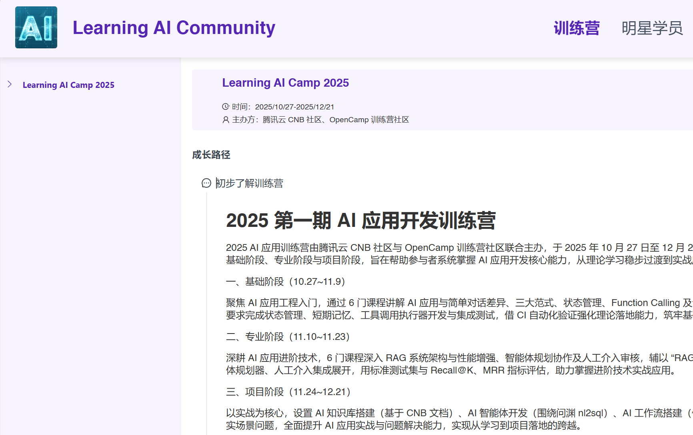

# AI应用课程实验项目 | Run qwen3 on Ollama via CNB

本仓库包含AI应用课程实验1-4的完整实现，涵盖结构化输出、有状态对话、内存系统和LangChain链式调用。

---

## 🎯 实验项目概览

实验项目位于 `ai-course-labs/` 目录，包含：

- **实验1**：结构化提示词与输出（Pydantic模型）
- **实验2**：有状态对话的快照验证（多会话管理）
- **实验3**：记忆系统的内容检索（LangChain Memory）
- **实验4**：LangChain链的确定性输出（广告文案生成）

## 前置条件
- 您必须报名 [AI 应用训练营](https://opencamp.cn/AI/camp/2025llm)

  

- 您必须在训练营个人中心完成 CNB 账号绑定

  

## 操作流程

- Fork 本仓库，解锁作业副本。
- 在您 Fork 的仓库中点击 **云原生开发** 按钮进入开发环境。
- 根据文档完成实验。
- 完成后提交代码到 main 分支，并创建合并请求。


- 最后可以在 pr 页面来查看评分过程（可多次提交代码，每次提交都会触发评分，以最高分为准）


- 如果通过，则可以在 opencamp 的晋级榜单上看到自己的成绩，如没有，请查看上一步的流水线日志。


### 🚀 快速开始实验

```bash
# 进入项目目录
cd ai-course-labs

# 安装依赖
pip install -r requirements.txt

# 确保 Ollama 服务运行并已下载 qwen3:8b 模型
# （本环境已预置，无需额外配置）

# 运行所有测试
pytest grader/ -v
```

### 📚 详细文档

请查看 [`ai-course-labs/README.md`](ai-course-labs/README.md) 获取：
- 详细实验指南
- 环境配置说明
- 调试建议
- 评分标准

---

## Ollama 环境说明


在 CNB 中直接 使用 Ollama 运行 qwen3，预置模型，无需等待，零帧起步。

## 快速体验

### 通过云原生开发体验

1. `Fork` 本仓库到自己的组织下
2. 选择喜欢的分支，点击 `云原生开发` 启动远程开发环境
3. 约 `5～9` 秒后，进入远程开发命令行，输入以下命令即可体验

> ${image} 为模型名称，如 `qwen3:8b`

```shell
ollama run ${image}
```

### 本仓库已内置模型列表

- `qwen3:0.6b`
- `qwen3:1.7b`
- `qwen3:1.7b-q8_0`
- `qwen3:4b`
- `qwen3:8b`
- `qwen3:14b`
- `qwen3:30b`
- `qwen3:32b`
- `qwen3-code:30b`

## 进阶

### 公网访问

在 `PORTS` 中将 Ollama 暴露到外网，添加 11434 端口即可。